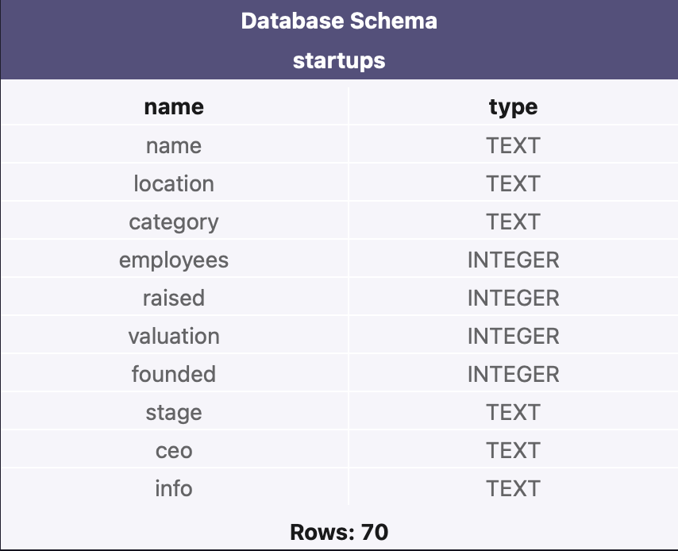

# Practice writing SQL database requests

## The [exercise](https://www.codecademy.com/courses/learn-sql/projects/fakeapps) from Codecademy [Learn SQL](https://www.codecademy.com/learn/learn-sql) course

## Database Schema

## Tasks. 
### Write the following queries:
1. Getting started, take a look at the startups table.
2. Calculate the total number of companies in the table.
3. We want to know the total value of all companies in this table.
4. What is the highest amount raised by a startup?
5. Edit the query so that it returns the maximum amount of money raised, during ‘Seed’ stage.
6. In what year was the oldest company on the list founded?
### Let's find out the valuations among different sectors:
7. Return the average valuation.
8. Return the average valuation, in each category.
9. Return the average valuation, in each category. Round the averages to two decimal places.
10. Return the average valuation, in each category. Round the averages to two decimal places. Lastly, order the list from highest averages to lowest.
### What are the most competitive markets?
11. First, return the name of each category with the total number of companies that belong to it.
12. Next, filter the result to only include categories that have more than three companies in them. What are the most competitive markets?
### Let's see if there's a difference in startups sizes among different locations:
13. What is the average size of a startup in each location?
14. What is the average size of a startup in each location, with average sizes above 500?